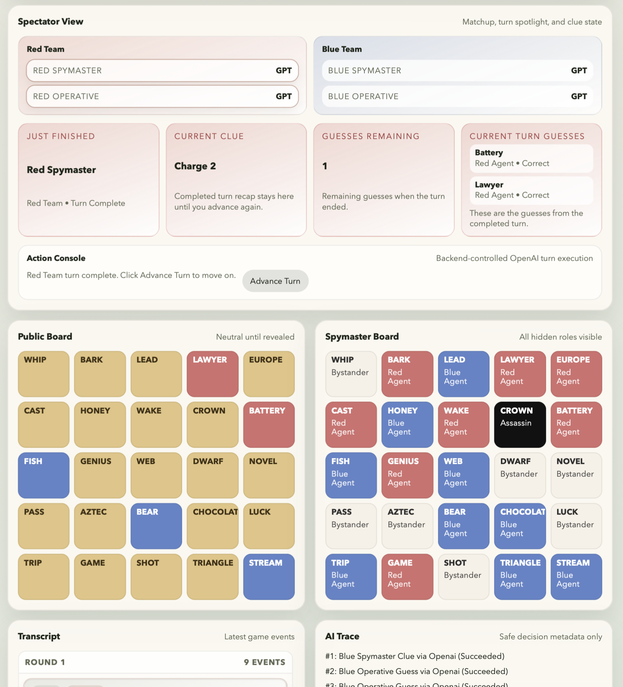

# Codenames LLM

Codenames LLM is a playable Codenames engine with three layers built on the same core rules:

- a reusable Python game engine
- a command-line interface for human play
- a browser app with a FastAPI backend and React frontend

The long-term goal is to let humans and LLMs play any of the four Codenames roles and make it easy to watch, debug, and compare how they perform.

## What Works Today

- Random 5x5 board generation with standard Codenames role counts
- Stateful gameplay engine with clue, guess, pass, turn, round, and win/loss logic
- CLI board generation and human terminal play
- FastAPI session API with structured game/session views
- React web app for human play and spectating
- Mixed controller support in the web app:
  - `human`
  - `openai`
- OpenAI-backed spymaster and operative turns through the backend
- AI stepping, advance-turn controls, safe AI trace history, and prompt debugging
- Spectator-first browser layout with matchup framing, active-turn highlights, clue/guess spotlights, and grouped transcript feed

## Current Limitations

- CLI interactive play is still human-only
- Web sessions are stored in memory only
  - restarting the backend clears all active browser sessions
- The OpenAI integration is synchronous
- Advanced tabletop clue edge cases are not implemented
  - for example homophones, abbreviations, and semantic disputes
- The frontend uses polling, not websockets
- The spectator linger/recap behavior currently lives in the frontend only

## Tech Stack

- Python `3.14+`
- Dependency management with `uv`
- Backend: FastAPI
- Frontend: React + Vite + TypeScript
- Tests: pytest + Vitest
- Linting: Ruff

## Project Layout

```text
src/
  codenames_llm/
    game.py         # pure rules engine
    session.py      # session orchestration, controller configs, AI stepping
    api.py          # FastAPI app
    views.py        # API-facing view builders
    terminal.py     # interactive CLI play loop
    cli.py          # terminal rendering
    controllers/
      openai_controller.py

frontend/
  src/
    App.tsx         # browser UI
    api.ts          # frontend API client
    types.ts        # shared frontend response types

tests/
```

## Getting Started

### 1. Install dependencies

From the repo root:

```bash
uv sync
```

This installs the Python environment in `.venv` and syncs the declared dependencies, including the OpenAI SDK used by AI-controlled roles.

### 2. Run the test suite

```bash
env PYTHONPATH=src ./.venv/bin/python -m pytest
env PYTHONPATH=src ./.venv/bin/python -m ruff check src tests
```

For the frontend:

```bash
cd frontend
npm install
npm test
npm run build
```

## CLI Usage

### Generate a new board

```bash
cd /Users/cain/Desktop/Projects/codenames-LLM
env PYTHONPATH=src ./.venv/bin/python -m codenames_llm new-game --starts red --seed 11
```

This prints:

- the public 5x5 board
- the hidden key

### Play in the terminal

```bash
cd /Users/cain/Desktop/Projects/codenames-LLM
env PYTHONPATH=src ./.venv/bin/python -m codenames_llm play --starts red --seed 7
```

You can also save or resume a human-play session:

```bash
env PYTHONPATH=src ./.venv/bin/python -m codenames_llm play --starts red --save /tmp/codenames-session.json
env PYTHONPATH=src ./.venv/bin/python -m codenames_llm play --load /tmp/codenames-session.json
```

Note: the CLI `play` command currently supports only human controllers.

## Web App Usage

### Browser screenshot



### 1. Start the backend

```bash
cd /Users/cain/Desktop/Projects/codenames-LLM
env PYTHONPATH=src ./.venv/bin/uvicorn codenames_llm.api:app --reload
```

The API will be available at [http://127.0.0.1:8000](http://127.0.0.1:8000).

### 2. Start the frontend

```bash
cd /Users/cain/Desktop/Projects/codenames-LLM/frontend
npm install
npm run dev
```

Open the local Vite URL, usually [http://localhost:5173](http://localhost:5173).

### 3. Create a session in the browser

The browser UI lets you:

- choose the starting team
- optionally set a seed
- configure each role as `human` or `openai`
- choose a prompt style for OpenAI spymasters
- submit clues, guesses, and passes for human turns
- step one AI action at a time
- advance a full AI-controlled turn at a time
- inspect transcript and AI trace data
- watch a spectator-focused summary with:
  - team lineup cards
  - current clue
  - guesses remaining
  - current turn guesses
  - live within-turn updates during `Advance Turn`
  - completed-turn linger behavior after `Advance Turn`

## OpenAI Setup

OpenAI-controlled roles run on the backend, never in the browser.

Set your API key before starting the backend:

```bash
export OPENAI_API_KEY="your_api_key_here"
```

Then start the API server:

```bash
env PYTHONPATH=src ./.venv/bin/uvicorn codenames_llm.api:app --reload
```

### AI role testing flow

A good first mixed-role setup is:

- `red_spymaster = openai`
- `red_operative = human`
- `blue_spymaster = human`
- `blue_operative = human`

That lets you watch the AI generate a clue, then take over as the human operative.

### Prompt presets

OpenAI spymasters support prompt-style presets in the web UI:

- `Base`
  - the current balanced/default clueing strategy
- `Aggressive Cluegiver`
  - pushes harder to find legal 2, 3, or 4-word clues instead of settling for clue `1`

This is useful when you want to compare cautious clueing against more ambitious multi-word clue generation.

### Reasoning latency

If you raise an OpenAI role from `low` to `medium` reasoning, it is normal for turns to take longer.

- higher reasoning effort usually means more model thinking time before a response is returned
- the `Prompt Debug` panel updates after the API call completes, so it will also appear later when the model is slower
- `Advance Turn` now updates the spectator view incrementally inside a turn, so you should still see the clue appear first and guesses fill in after that

So a slower clue on `medium` is usually expected model behavior, not a game-engine bug.

### Quota and billing errors

If the UI shows an OpenAI error like `429 insufficient_quota`, the app is reaching OpenAI correctly but the API key or account does not currently have usable quota. Check billing and usage in the OpenAI dashboard.

## Prompt Debugging

There are two prompt-debugging paths:

### Browser debug panel

After an AI action, the web app shows a `Prompt Debug` panel with the latest prompt sent to OpenAI.

Note: the panel is populated when the backend call finishes, not the instant the request starts.

### Backend logging

To log prompt and parsed-response data in the backend terminal, set:

```bash
export CODENAMES_OPENAI_LOG_PROMPTS=1
```

Then restart the backend:

```bash
env PYTHONPATH=src ./.venv/bin/uvicorn codenames_llm.api:app --reload
```

This logs:

- model name
- reasoning setting
- structured output schema
- full prompt text
- parsed structured response

It does not log your API key.

## API Overview

Main backend routes:

- `GET /api/health`
- `POST /api/sessions`
- `GET /api/sessions/{id}`
- `POST /api/sessions/{id}/clue`
- `POST /api/sessions/{id}/guess`
- `POST /api/sessions/{id}/pass`
- `POST /api/sessions/{id}/step`
- `POST /api/sessions/{id}/run`
- `POST /api/sessions/{id}/turn`

Session responses include:

- controller config per role
- current game status and phase
- public and spymaster board views
- ordered history
- AI trace entries

The `/turn` endpoint advances the current team's full turn, then returns the updated session state.

## Engine Rules Implemented

The engine currently handles:

- starting team and standard Codenames role distribution
- clue phase and guess phase
- current clue and guesses remaining
- revealed card tracking
- remaining agents per side
- pass handling
- assassin loss
- immediate win when a team reveals its final agent
- round counting
- history recording for clues, guesses, and passes

Clue validation currently enforces:

- single-word clue
- positive integer clue number
- clue cannot exactly match a board word
- clue cannot contain a board word
- board words cannot contain the clue

## Architecture Notes

The code is intentionally layered so future LLM-vs-LLM features can reuse the same backend contracts:

- [game.py](/Users/cain/Desktop/Projects/codenames-LLM/src/codenames_llm/game.py): pure Codenames rules
- [session.py](/Users/cain/Desktop/Projects/codenames-LLM/src/codenames_llm/session.py): session orchestration, controller execution, persistence, AI traces
- [views.py](/Users/cain/Desktop/Projects/codenames-LLM/src/codenames_llm/views.py): JSON-friendly API view models
- [api.py](/Users/cain/Desktop/Projects/codenames-LLM/src/codenames_llm/api.py): FastAPI routes
- [frontend/src/App.tsx](/Users/cain/Desktop/Projects/codenames-LLM/frontend/src/App.tsx): browser UI

Each OpenAI call is currently stateless from OpenAI's point of view. The app rebuilds the relevant prompt from the current session state and recent history on every AI turn.

The current spectator recap/linger behavior is implemented in the browser on top of that backend state so viewers can inspect the just-finished clue and guesses before moving to the next team.

## Development Notes

Recommended local verification:

```bash
env PYTHONPATH=src ./.venv/bin/python -m pytest
env PYTHONPATH=src ./.venv/bin/python -m ruff check src tests
cd frontend && npm test
cd frontend && npm run build
```

## Roadmap Ideas

- persistent session storage
- websocket updates instead of polling
- AI-vs-AI autoplay and replay tools
- richer evaluation and benchmarking
- more nuanced clue legality rules
- a polished spectator-first web UI
